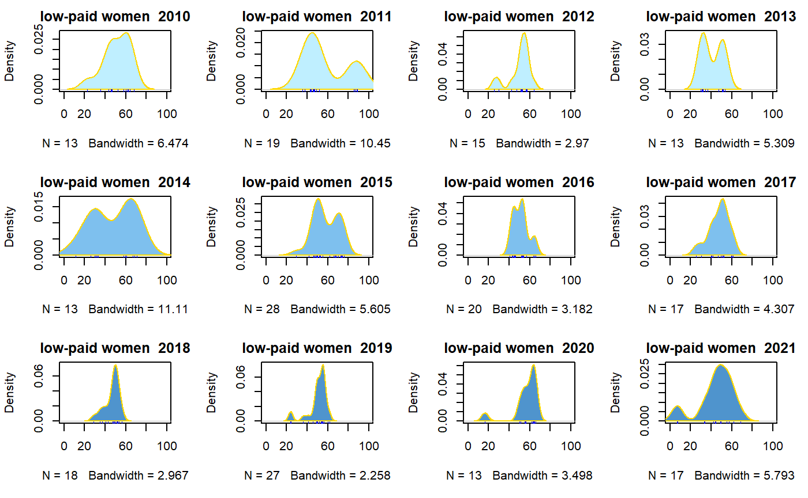
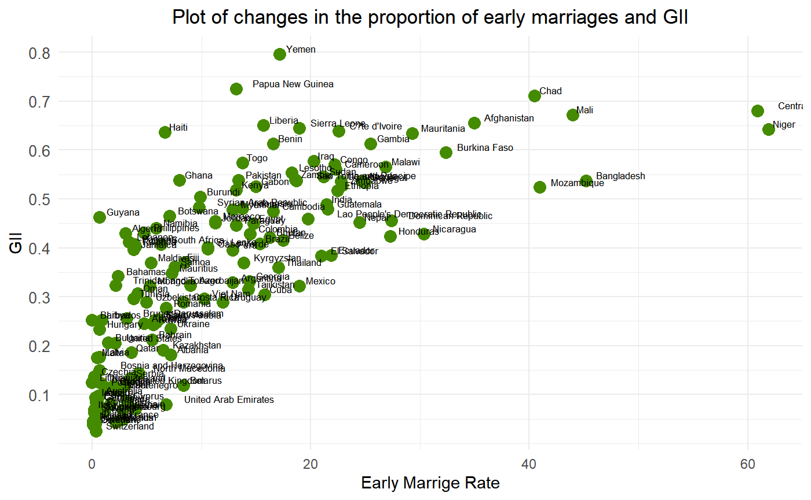

## 项目简介
参与华东师范大学与南洋理工大学的合作交换科研项目，通过系统学习科研论文写作的思维方法，以及实际实操数据分析相关软件（python、R、Excel），最终与来自三个不同专业的小组成员一起，完成了一篇名为 Global
Happiness and Life Satisfaction: Exploring the Factors 的结项论文。

## 答辩环节
代表小组完成针对论文的结项答辩，在 QA 环节熟练用英语与教授沟通作答，获得了南阳商学院知名教授 Teoh 的高度评价。

## 能力收获
学习了 IMRAD 的论文结构、制作科研海报的方法、锻炼了英语听说的能力，自傲组组织能力，增加了实践经验。

## 项目成绩
整体课程获得 4.5 的 Grade Point，Grade Description 为 Excellent。

## 结果展示（摘取部份图表及回归结果）

## 查看完整项目文件
- 查看完整的 R Markdown 代码：[毕业论文.Rmd](code/毕业论文.Rmd)
- 下载项目完整报告：[王若溪-毕业论文终稿.pdf](pdf/王若溪-毕业论文终稿.pdf)
