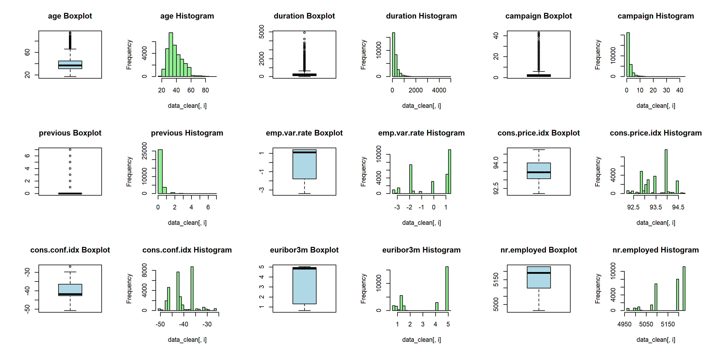
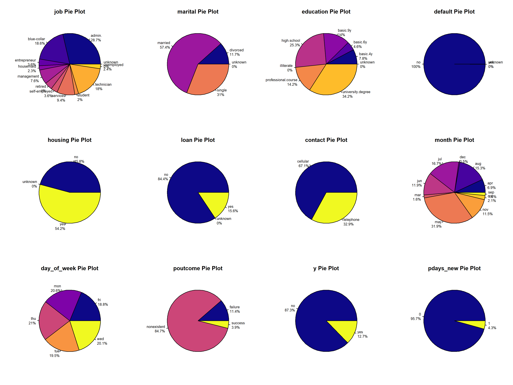
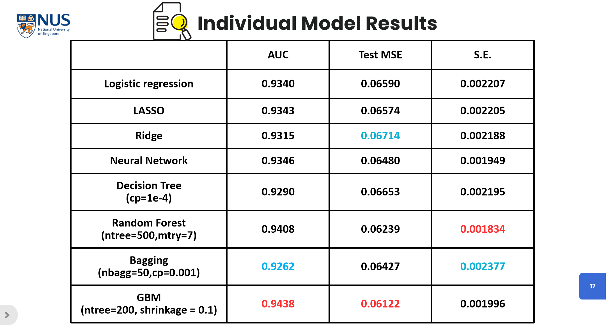
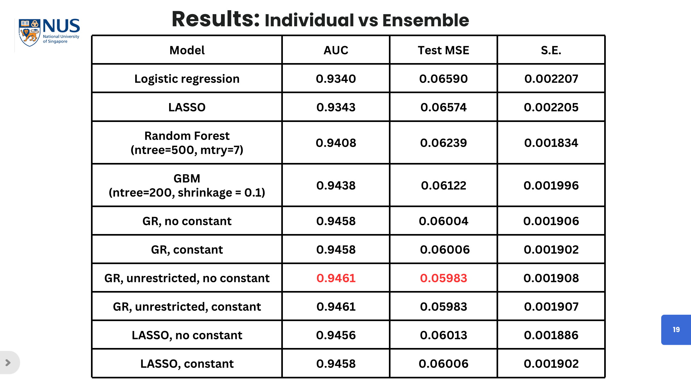
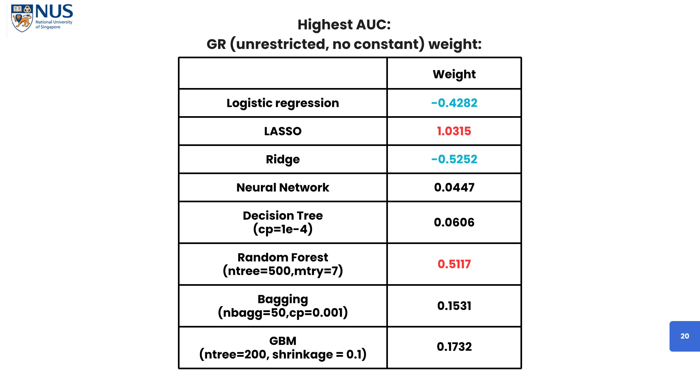
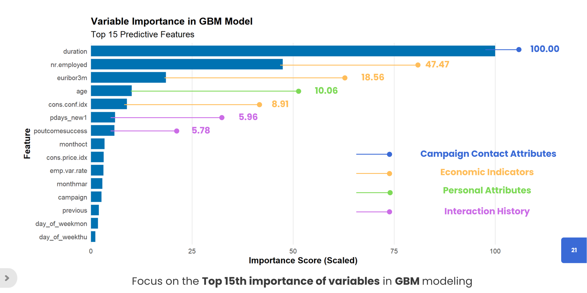

## 项目时间
2024.10 – 2024.11

## 项目简介
本项目基于 UCI 银行营销公开数据集，对多种机器学习模型进行开发、评估与集成优化，并提出可解释性改进方案。

## 数据采集与预处理
- 选用 UCI 银行营销数据集（41,188 条、21 个变量）对 `pdays` 字段进行二值化处理，剔除缺失与异常值 ； 
- 按 3:1:1 分层抽样构建训练集 / 验证集 / 测试集 ； 
- 调用 `ggplot2` 绘制散点图、箱线图、ROC 曲线等 10 余种可视化，直观揭示客户人口属性、经济指标与营销响应的关联。

## ML 模型开发与评估
- 基于 `caret`、`glmnet`、`gbm` 等 R 包，完整实现 9 种算法：  
  - Logistic 回归、Lasso、Ridge、Elastic Net、决策树、随机森林、Bagging、GBM、神经网络  
- 采用网格搜索 + 5 折交叉验证优化超参数  
- 最优 GBM 模型 AUC 达 0.9438，集成模型 AUC 提升至 0.9461  

## 结果展示
- 定量变量-直方图+箱线图可视化  

- 定性变量-饼图可视化  

- 不同机器学习模型结果比较 
  

- 混合模型效果展示 

- 最好的模型-GBM 变量重要性展示   
  

## 查看完整项目文件
- R 代码下载：[gp_final.R](code/gp_final.R)  
- 报告下载：[ML_Project.pdf](pdf/group2.pdf)  
