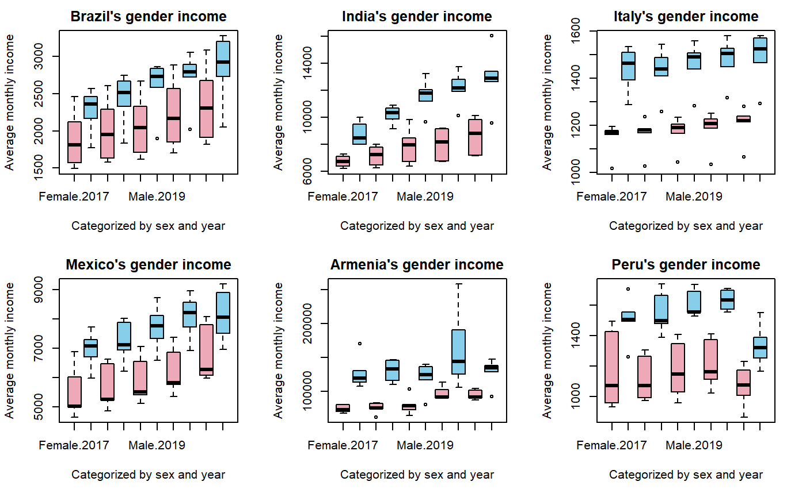

## 项目简介
基于一份 10 万条目量级的车辆信息数据集，编写精简代码从中提取出每一条对应的车辆品牌和型号。其中大量利用自建函数和循环判断，筛选完直观明显的大类情况后逐个拆解考虑特殊命名下的小类别，最终把完全无法识别
的条目数量控制在 400 条以下，识别率达到 99.64%。

## 流程图展示
将整体思路绘制成两页 A4 纸长度的流程图，包含对所有情况的讨论。

## 查看完整项目文件
- 查看完整的 R Markdown 代码：[毕业论文.Rmd](code/毕业论文.Rmd)
- 下载项目完整报告：[王若溪-毕业论文终稿.pdf](pdf/王若溪-毕业论文终稿.pdf)
