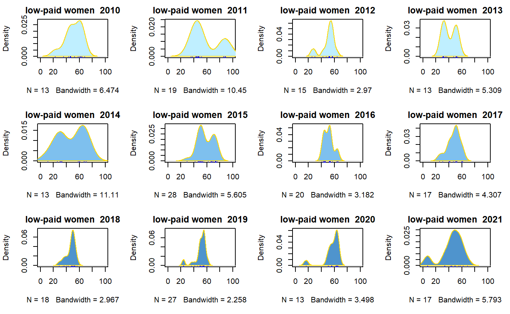
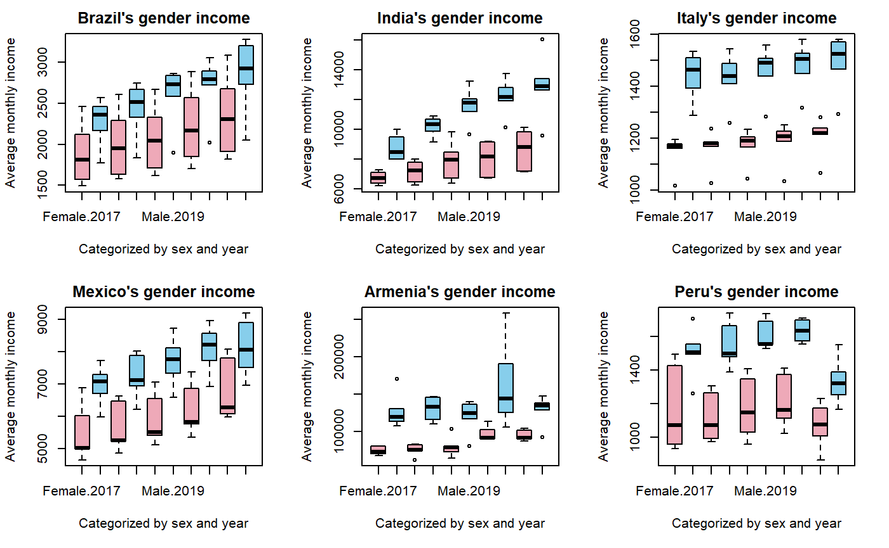

## 项目简介
本课题是基于 R 语言完成的一份完整数据分析项目，立足全世界男女经济收入的各项指标来分析性别不平等问题。

## 选题及预处理
捕捉到当下与两性有关的热点议题，从联合国官方网站，国际劳工组织，经合组织，世界银行等来源收集整理数据，筛选有效指标，处理缺失异常值。

## 可视化
导入 R 并针对数据特点画出了一系列图表（使用了 R 自带画图函数以及 ggplot2，lattice 等画图包），包括散点图，柱形图，核密度图，箱线图，频数分布直方图等。
归纳总结出世界各地不同因素对男女性经济收入的影响程度，以及当下性别权益失衡的现状。

## 建模分析
处理了数据的多重共线性，异方差性，内生性等问题。
利用现有数据对未来进行了预测，包括建立线性拟合模型，模型诊断，K 折交叉验证，聚类算法等；针对目前及未来趋势，从政府企业个人等诸多维度给出了一定的缓解措施建议。

## 结果展示（摘取部份图表及回归结果）

## 查看完整项目文件
- 查看完整的 R Markdown 代码：[毕业论文.Rmd](code/毕业论文.Rmd)
- 下载项目完整报告：[王若溪-毕业论文终稿.pdf](pdf/王若溪-毕业论文终稿.pdf)
