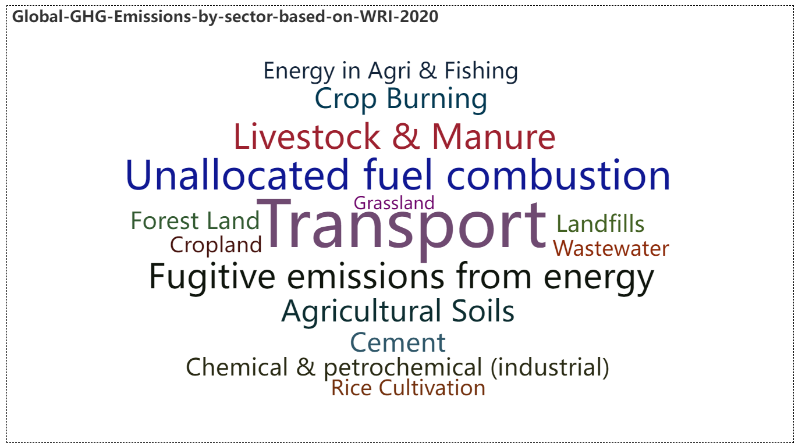
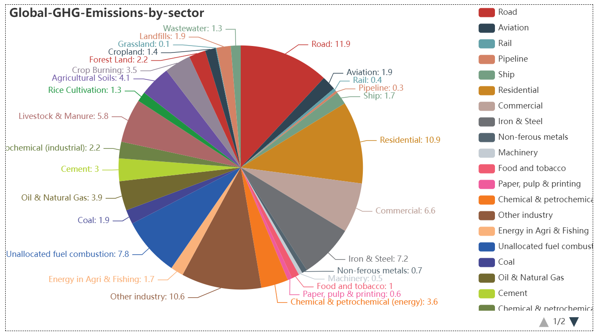

## 项目简介
本课题是基于 python 完成的一份完整数据分析项目，分析了不同指标与碳排放之间的相关性，找出最直接影响碳排放的几大因素，并通过时序网络预测气温变化规律，与实际气温变化进行对比

## 选题及预处理
基于新能源汽车的兴起和市场扩张这一热点话题，确立议题。收集并处理数据：在统计年鉴，CEIC数据库等官方权威网站上搜集数据，下载并整理为 Excel 表格。

## 可视化
利用收集到的数据编写程序绘制图表并进行图表分析，图表主要使用 3D 动态变化图，使用模块 pyecharts。

## 相关性分析
首先确定 13 个可能的影响因素，主要有 GDP，能源消耗量，汽车数量等。然后通过 excel 制成数据矩阵，并将数据矩阵导入 jupyter。

## 描述性分析
查看数据的整体特征，通过 matplotlib 绘制某因素和碳排放之间的散点图观察大致的变化趋势。

## 模型预测
构建多元线性回归，高次线性回归，人工神经网络等不同模型，并考察不同模型的拟合效果。

## 结果展示（摘取部份网页动态3D图表及静态分析图）
以下是动态图表的展示，可移动鼠标至图表上查看动态图表的变化过程并尝试交互。

- 
- 
- 
- 

以下是动态图表的部份静态展示：

## 查看完整项目文件
- 查看完整的python代码：[数据可视化.ipynb](code/数据可视化部分代码.ipynb) \ [描述性统计.ipynb](code/描述性统计.ipynb) \ [北半球气温预测.ipynb](code/北半球气温预测最终版.ipynb)
- 下载项目完整报告：[基于CO2和GHG相关指标数据分析全球碳排放情况.docx](pdf/基于CO2和GHG相关指标数据分析全球碳排放情况.docx)
