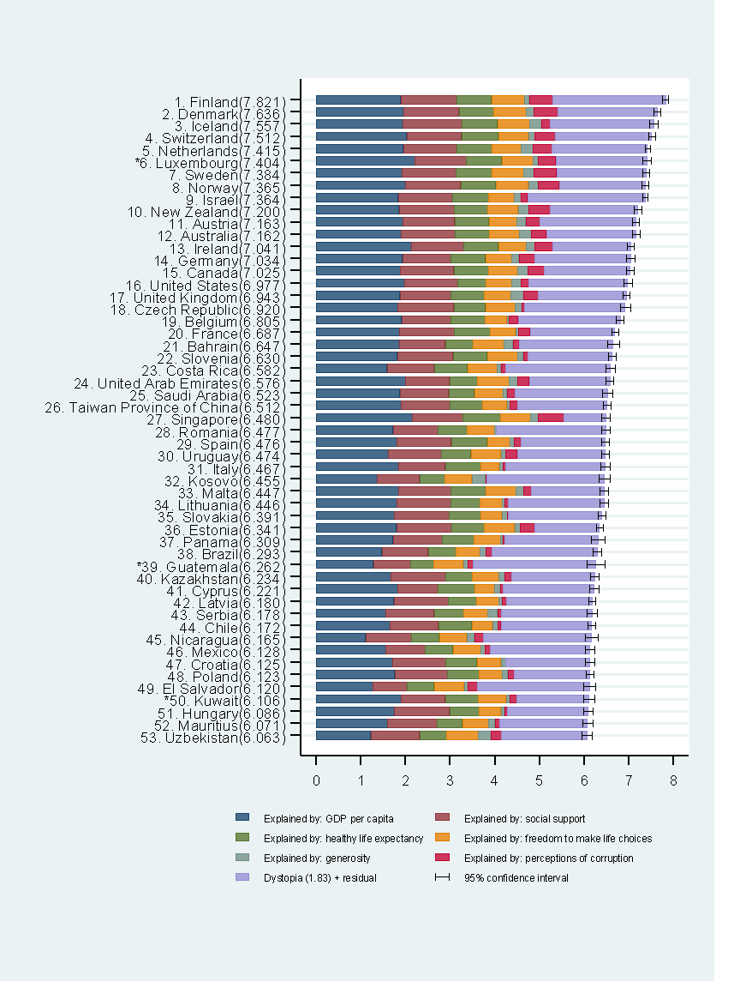
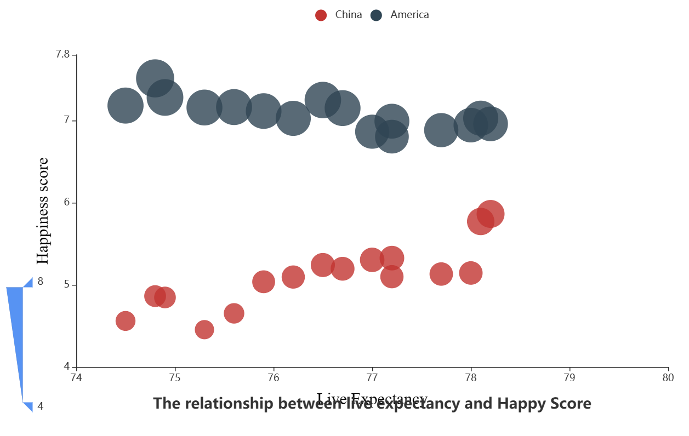
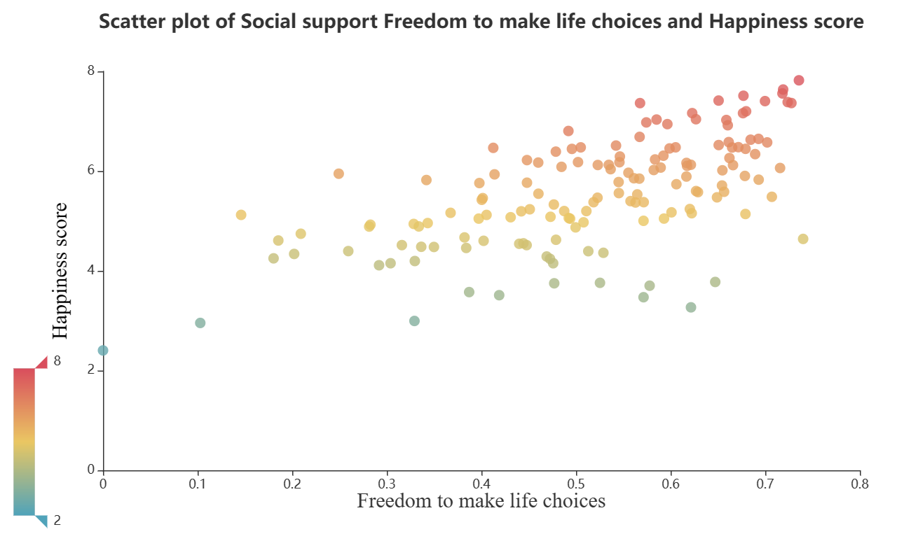

## 项目简介
- 在网易大型同人平台-Lofter 上进行同人文创作，截止 2025 年 1 月粉丝数已达 1.2w+。总共创建 19 个不同 ip 的合集。（游戏-原神，崩坏星穹铁道，恋与深空，世界之外，光与夜之恋，未定事件薄，恋与制作人，时空中的绘
旅人，花亦山心之月。动漫-排球少年，蓝色监狱，Free 男子游泳部，文豪野犬，铃芽之旅等。）累计创作 256篇作品，总字数达 78w+，收获了 73.2w+热度，1.2w+评论，共拥有 8.2w+支持者。
- 作为 Lofter 官方灯塔计划的成员，宗师鸽身份创作者，创作作品长期享有流量扶持和官方推荐。
- 熟知众多热门二次元内容，创作方向集中于乙女向，短中长篇行文结构都可轻松驾驭，成稿速度快（思路成熟时可达 2k 字/h），构思完善，擅长埋有趣的彩蛋。古风，西幻，现代等文风都可熟练驾驭，真心热爱着笔下的每一字句。
- 担任过数次站内大型节日 24h 联文企划的负责人，除创作同人文外，擅长制作宣传海报，邀请站内知名老师参与企划。拥有良好的美工排版能力和审美水平，拥有将一项企划从宣发到推动落地的全流程监管能力。

## 主页展示

## Lofter个人界面
[Rannie西西的Lofter博客](https://rannie453.lofter.com)
