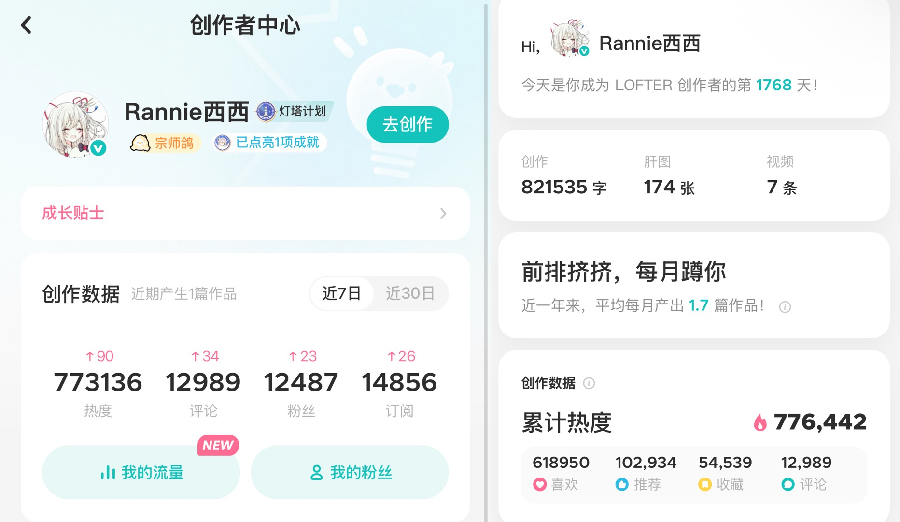

## 项目简介
- 在网易大型同人平台-Lofter 上进行同人文创作，截止 2025 年 8 月粉丝数已达 1.2w+。总共创建 20 个不同 ip 的合集。（游戏-原神，崩坏星穹铁道，明日方舟、恋与深空，世界之外，光与夜之恋，未定事件薄，恋与制作人，时空中的绘旅人，花亦山心之月。动漫-排球少年，蓝色监狱，Free男子游泳部，文豪野犬，铃芽之旅等。）累计创作 268 篇作品，总字数达 82w+，收获了 77w+热度，1.3w+评论，共拥有 8.6w+支持者。
  
- 作为 Lofter 官方认证同人文作者、灯塔计划的成员，宗师鸽身份创作者，创作作品长期享有流量扶持和官方推荐。
  
- 熟知众多热门二次元内容，创作方向集中于乙女或女性向，短中长篇行文结构都可轻松驾驭，成稿速度快（思路成熟时可达 2k 字/h），构思完善，擅长埋有趣的彩蛋。古风，西幻，现代等文风都可熟练驾驭，真心热爱着笔下的每一字句。
  
- 策划多场24小时节庆联文企划，从主题框架与排期制定、宣传文案撰写，到海报设计与30+知名作者邀约，推动项目覆盖50万+读者，社群互动率提升20%。

## 主页数据展示

## Lofter个人主页网址
[Rannie西西的Lofter博客](https://rannie453.lofter.com)
