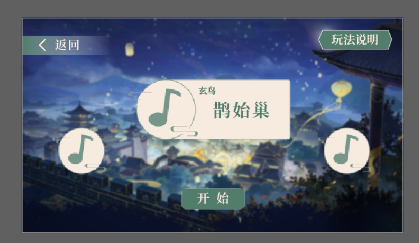

## 框架构建
担任概念设计，构建出本小组乙女+音游游戏《千曲解意录》的整体世界观，故事背景和大致框架。

## 文案撰写
担任主文案策划，撰写本作男主钟晏的全部主线剧情（包括共通线，分支选项，三种走向结局），共计2.0w+文本量；

## 数值分析
担任数值策划，为一支曲谱的玩家得分，曲子完成度设计算法公式表，并进行超过 200 次极限试算，以保证数值玩家得分与曲子完成度的误差控制在±3%以内；

## 细化包装
对游戏做整体文案包装：按不同词牌名的平仄韵律结构撰写 5 首宋体信物诗词，3 首剧情结局诗词，3关音游评书诗赋。为剧情小节和音游关做名称包装，将剧情关卡的内容联系音游，在主线故事中给出暗示和连接；

## 玩法设计
担任玩法策划，设计音游玩法谱面，激发了对互联网大厂的追求和游戏制作的更深兴趣。

## 玩家反馈
最终游戏得到了腾讯北极光工作室的策划老师们一致好评，文案部分获得该次夏令营所参赛作品中最佳文案奖。小组成员此后各自在自己的大学中分发调研问卷，在组织的 3 场高校试玩活动中，累计收集了超过 800
份调研问卷，有效回答的 758 名参与者中有 84%认为题材新颖、设计巧妙，且有意持续游玩，玩家满意度高达90%。

## 结果展示（摘取部份UI界面）
- 剧情分支选项
- 
- 音游结算界面
- 
- 音游关卡内
- 
- 曲谱点选界面
- 

## 查看完整项目文件
- minigame《千曲解意录》世界观与人物设定大纲：[《千曲解意录》世界观+人物设定.doc](pdf/《百物行》世界观+人物设定.doc)
- 数值演算：[数值推导.xlsx](pdf/推导.xlsx)
- 完整游戏demo：[百度网盘链接: https://pan.baidu.com/s/1h6UcPu75NL1nRveJUE8knw?pwd=35pw](https://pan.baidu.com/s/1h6UcPu75NL1nRveJUE8knw?pwd=35pw) **提取码:** 35pw
